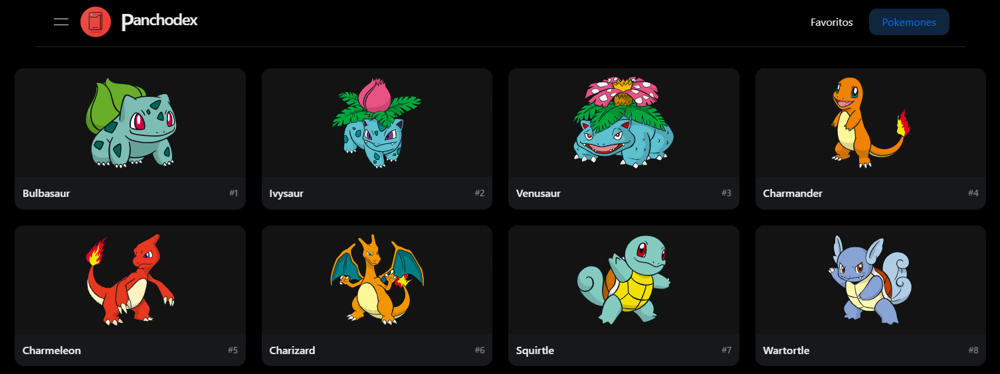
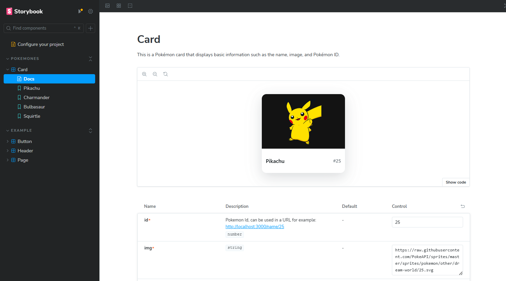

# Panchodex

## Getting Started

> You need to use Node version 18.19.1

First, Install dependencies:

```bash
yarn install
```

Second, run the development server:

```bash
yarn dev
```

Open [http://localhost:3000](http://localhost:3000) with your browser to see the result.



## Storybook

```bash
yarn storybook
```

Open [http://localhost:6006](http://localhost:6006) with your browser to see the result.


Created by: [Francisco Nakú Acosta Zárate](https://www.linkedin.com/in/francisco-nak%C3%BA-acosta-z%C3%A1rate-a2693681/)
